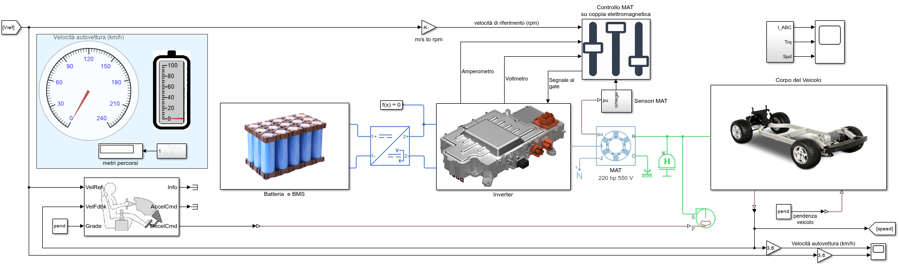

# Modello di Veicolo Elettrico con Motore Asincrono Trifase in Simscape

Questo repository ospita un modello di Veicolo Elettrico a Batteria (BEV) sviluppato utilizzando Simscape, che utilizza come propulsore un motore asincrono trifase. Il modello rappresenta un’analisi della catena cinematica longitudinale per un veicolo elettrico.

